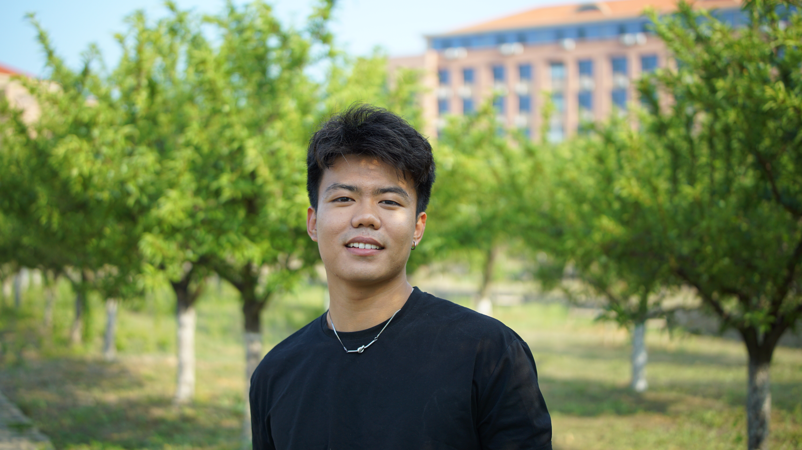

# 张嘉树 · Jiashu (Joshua) Zhang

**山东大学 网络空间安全学院 · 硕士研究生**  
*School of Cyber Science and Technology, Shandong University · M.S. Student*

[密码技术与信息安全教育部重点实验室](https://infosec.sdu.edu.cn/)  
*Key Laboratory of Cryptography Technology and Information Security, Ministry of Education*

📧 [joshua020827@163.com](mailto:joshua020827@163.com) · 🐙 [GitHub](https://github.com/JarmanZ)

---

## 个人简介 / About

张嘉树，山东大学网络空间安全学院硕士研究生，就读于密码技术与信息安全教育部重点实验室。主要研究方向为对称密码分析，当前工作聚焦于利用几何方法开展积分分析研究，探索积分分析与 multiple-of-8 性质之间的内在联系，以及混合基（Mix-Basis）下的基于几何方法的分析技术。

*Jiashu (Joshua) Zhang is a master's student at the School of Cyber Science and Technology, Shandong University, affiliated with the Key Laboratory of Cryptography Technology and Information Security, Ministry of Education. His research focuses on symmetric-key cryptanalysis, particularly integral cryptanalysis with a geometric approach. His current work explores the connection between integral cryptanalysis and the multiple-of-8 property, as well as mix-basis geometric approaches.*

## 研究方向 / Research Interests

- 对称密码分析 *(Symmetric-key Cryptanalysis)*
- 积分分析 *(Integral Cryptanalysis)*
- 集合方法 / 几何方法 *(Set-based / Geometric Methods)*
- 积分分析与 multiple-of-8 性质的联系 *(Connection between Integral Cryptanalysis and the Multiple-of-8 Property)*

## 发表论文 / Publications

**Unlocking Mix-Basis Potential: Geometric Approach for Combined Attacks**

Kai Hu, Chi Zhang, Chengcheng Chang, **Jiashu Zhang**, Meiqin Wang & Thomas Peyrin

*Advances in Cryptology — CRYPTO 2025*

[DOI ↗](https://doi.org/10.1007/978-3-032-01901-1_10)

---

© 2025 张嘉树 · 山东大学网络空间安全学院 · Shandong University
